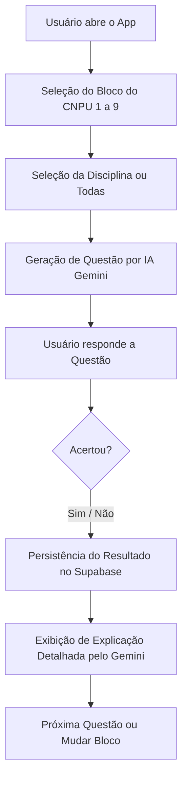

# 🧠 StudQuiz (Estuda CNPU) - Documentação Principal

Bem-vindo à documentação principal do **StudQuiz**, uma plataforma interativa de estudos para o **Concurso Nacional Público Unificado (CNPU)** baseada em Inteligência Artificial. 

Este documento descreve a arquitetura, o fluxo de funcionamento, o modelo de dados e o guia de reinicialização do projeto utilizando a nova stack: **uv**, **Supabase** e **Streamlit**.

---

## 📋 1. Visão Geral da Ideia e Funcionamento

O **StudQuiz** foi concebido para automatizar a geração de questões simuladas de alta qualidade e adaptadas às diretrizes do CNPU, utilizando o LLM Gemini da Google e persistindo o progresso do candidato de forma segura.

### Fluxo do Usuário


1. **Escolha de Bloco e Disciplina**: O usuário seleciona um bloco temático do CNPU (de 1 a 9). Os tópicos e disciplinas correspondentes são carregados a partir de arquivos locais de metadados.
2. **Geração por IA**: A aplicação solicita ao modelo `gemini-2.5-flash-lite` a criação de uma questão inédita baseada na disciplina, tópico sorteado e nível de dificuldade atual.
3. **Interação no Frontend**: O usuário responde no Streamlit, recebe feedback imediato e uma explicação detalhada.
4. **Registro de Desempenho**: Cada resposta é salva no banco de dados para computar estatísticas de desempenho.

---

## 🛠️ 2. Stack Tecnológica Atualizada

*   **Gerenciador de Dependências**: [uv](https://github.com/astral-sh/uv) (Extremamente rápido, substitui pip, pip-tools e virtualenv).
*   **Frontend / Interface**: [Streamlit](https://streamlit.io/) (Interface rica e reativa construída 100% em Python).
*   **Backend & Banco de Dados**: [Supabase](https://supabase.com/) (PostgreSQL relacional, Autenticação de usuários, Row Level Security e API imediata).
*   **Gerador de Questões**: API do Google Generative AI (`gemini-2.5-flash-lite`).

---

## 🗄️ 3. Modelo de Dados (Supabase - PostgreSQL)

A transição do Firebase Firestore (NoSQL) para o Supabase (PostgreSQL) exige a criação de tabelas estruturadas. Abaixo está o esquema SQL a ser rodado no editor SQL do Supabase.

### Estrutura de Tabelas

```sql
-- Extensão necessária para UUIDs automáticos
create extension if not exists "uuid-ossp";

-- 1. Tabela de Questões Geradas (Opcional, para cache/histórico de questões)
create table questoes (
    id uuid default gen_random_uuid() primary key,
    disciplina text not null,
    topico text not null,
    subtopico text,
    dificuldade integer not null,
    enunciado text not null,
    alternativas text[] not null, -- Array do Postgres para armazenar as 5 opções
    resposta_correta_idx integer not null,
    explicacao text not null,
    criado_em timestamp with time zone default timezone('utc'::text, now()) not null
);

-- 2. Tabela de Respostas dos Usuários (Histórico de Desempenho)
create table respostas_usuarios (
    id uuid default gen_random_uuid() primary key,
    user_id uuid not null, -- Referencia o auth.users do Supabase Auth
    question_id text not null, -- Pode ser UUID da tabela 'questoes' ou identificador gerado
    resposta_usuario_idx integer not null,
    acertou boolean not null,
    respondido_em timestamp with time zone default timezone('utc'::text, now()) not null
);

-- Habilitar RLS (Row Level Security) para segurança
alter table respostas_usuarios enable row level security;

-- Política de RLS: Usuário só lê e insere suas próprias respostas
create policy "Usuários podem ver suas próprias respostas" 
    on respostas_usuarios for select 
    using (auth.uid() = user_id);

create policy "Usuários podem inserir suas próprias respostas" 
    on respostas_usuarios for insert 
    with check (auth.uid() = user_id);
```

---

## 🚀 4. Guia de Configuração e Inicialização com `uv`

### Passo 1: Instalar o `uv` (caso não tenha instalado globalmente)
```powershell
powershell -c "irm https://astral.sh/uv/install.ps1 | iex"
```

### Passo 2: Criar e Inicializar o Ambiente Virtual
Na raiz do projeto `estuda_cnpu`, rode:
```bash
# Inicializa o projeto Python com uv
uv init

# Cria o ambiente virtual (.venv)
uv venv

# Ativa o ambiente virtual (Windows)
.venv\Scripts\activate
```

### Passo 3: Sincronizar Dependências
Instale as dependências diretamente através do `uv`:
```bash
uv add streamlit supabase google-generativeai python-dotenv pandas
```

### Passo 4: Configurar as Variáveis de Ambiente
Crie um arquivo `.env` na raiz do projeto contendo:
```env
# Supabase Config
SUPABASE_URL="https://seu-projeto-id.supabase.co"
SUPABASE_KEY="sua-chave-anon-publica"

# Gemini Config
GEMINI_API_KEY="sua-chave-api-gemini"
```

---

## 📂 5. Estrutura Proposta de Arquivos

```text
estuda_cnpu/
├── .env                  # Chaves secretas (Supabase e Gemini)
├── README.md             # Esta documentação principal
├── app.py                # Ponto de entrada do app Streamlit
├── pyproject.toml        # Gerenciado pelo uv (dependências)
├── csv/                  # Banco de dados de tópicos (Blocos 1 a 9)
│   ├── bloco_1.txt
│   └── ...
├── models/
│   ├── __init__.py
│   └── question.py       # Modelo Dataclass de Question
├── services/
│   ├── __init__.py
│   ├── supabase_service.py # Novo serviço de integração (Auth e DB)
│   └── gemini.py         # Gerador de questões via LLM
└── utils/
    ├── __init__.py
    └── parser.py         # Parser para ler tópicos do CSV
```

---

## 📈 6. Próximos Passos na Reinicialização

1. **Configurar o banco e chaves** no painel do Supabase.
2. **Executar o script SQL** acima no painel do Supabase.
3. **Instalar pacotes** via `uv` conforme guia do Passo 4.
4. **Implementar a classe `SupabaseService`** em `services/supabase_service.py`.
5. **Atualizar as chamadas** no arquivo principal `app.py` substituindo as chamadas de `firebase_service` para `supabase_service`.
